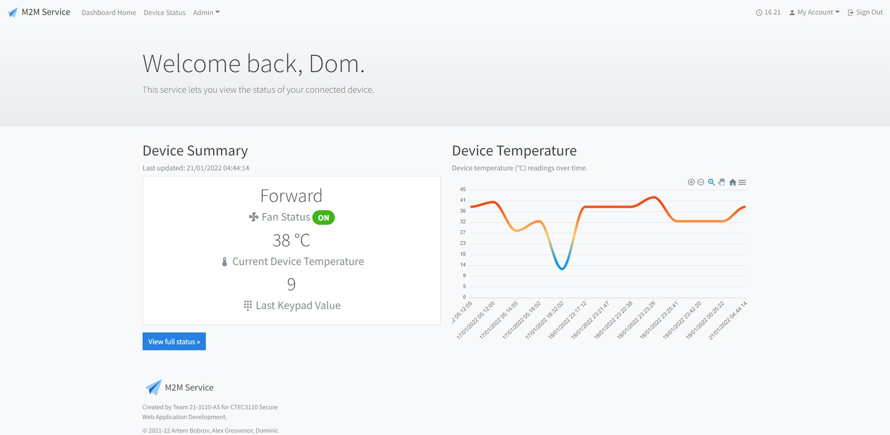
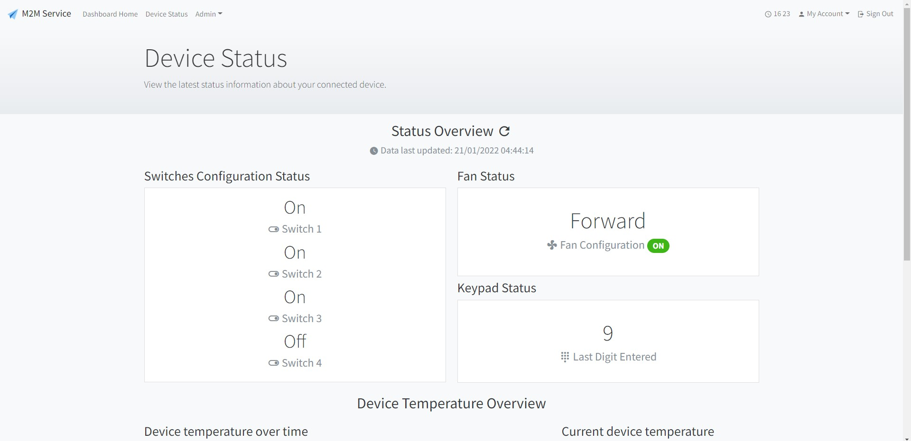
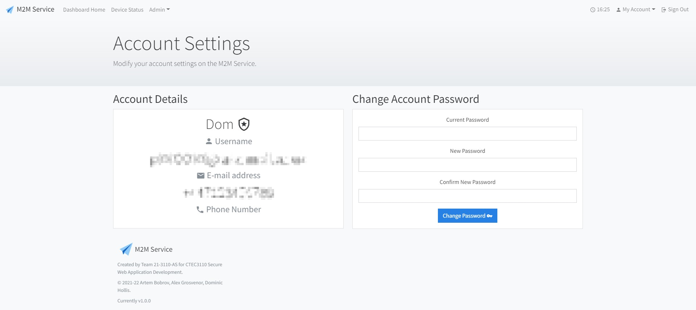

# M2MService
M2MService is a PHP web application that interfaces with the EE M2M Connect platform for the purpose of receiving SMS messages

## Introduction
The service connects to the EE M2M Connect platform over the SOAP protocol - as seen in the EE M2M Connect developer handbook.

The objective of this web application is to correctly receive SMS messages (via EE M2M Connect), parse/format and then display the information to the end user via the web application.

The messages that are received, parsed/formatted and then displayed by this web application contain the status of a (simulated) telematics board.

## What's inside the message?
The SMS message contains the current status of components on the telematics board:
- The on/off states of four switches on the board
- Fan status (on/off)
- Fan State (forward/reverse)
- Heater status (on/off)
- Current heater temperature (Celsius)
- Last digit entered on the keypad (i.e. 9)

During a typical use-case scenario, a message is sent to a phone number that is registered on the EE M2M Connect platform that contains these values - this is done by the telematics board. The application then pulls this SMS message from the EE M2M Connect platform (via SOAP) where it is ultimately displayed to the end user.

For the purpose of this [university] assignment, the SMS message contains the team name. It should be pointed out that the team name is taken into account by the web application to ensure that the SMS message belongs to our team, and not to another team who may have a similarly structured message to avoid any problems (other teams on this project also used the same EE M2M Connect gateway as us).

## EE M2M Connect Platform and SOAP
The M2M Connect platform is an online service provided by EE (part of BT Group) that allows business customers to send/receive SMS messages. This online service is primarily aimed for businesses that use SIM connected equipment (such as vehicle trackers), where this online service allows businesses to easily interact with their equipment via M2M (Machine-to-Machine).

The web application interacts with this online service via SOAP (Simple Object Access Protocol) - using the PHP SoapClient library.

## Web Application
This web application predominantly uses PHP as well as a PHP micro-framework called 'Slim' for MVC. In addition to this, the application uses SQL (database), PHPUnit (application testing), Twig (templates) and front-end components (Boostrap, ApexCharts).

## Authors
- Dominic Hollis
- Artem Bobrov
- Alex Grosvenor

## Screenshots

